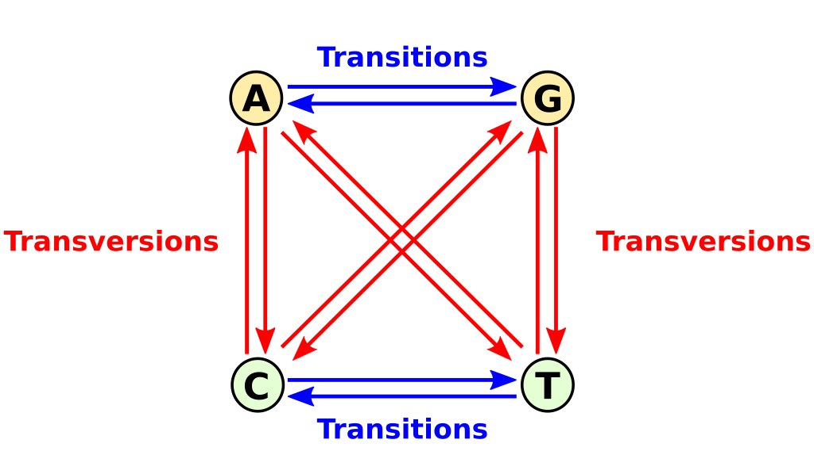

### Deklaracje preprocesora

```cpp
#include <iostream>
```

```cpp
#define PI 3.14
```

---

```cpp
#define ERROR 0
#define SUCCESS 1

int main() {

    int a = ERROR;
    int b = SUCCESS;

    return 0;
}
```

`g++ -E -Wall -o main.pre.cpp main.cpp`

---

### Wyrażenie warunkowe

```cpp
int max(int a, float b) {
    if( a > b )
        return a;
    else
        return b;
}
```

---

### Wyrażenie warunkowe

```cpp
int max(int a, float b) {
    if( a > b )
        return a;
    else
        return b;
}
```

###### rezultat = warunek ? wartość_gdy_prawda : wartość_gdy_fałsz;

```cpp
int max(int a, float b) {
    return ( a > b ) ? a : b;
}
```

---

### Zadanie Lab I

Napisz program, który obliczy miejsca zerowe funkcji kwadratowej.

---

```cpp
#include <iostream>
#include <cmath>

#define ERROR 0
#define SUCCESS 1

int solve_quadratic(float a, float b, float c, float * x1, float * x2) {
    float delta = b*b - 4*a*c;
    if( delta < 0 ) return ERROR;

    float delta_sqrt = sqrt(delta);
    float solution_x1 = (-b - delta_sqrt)/(2*a);
    float solution_x2 = (-b + delta_sqrt)/(2*a);

    *x1 = solution_x1;
    *x2 = solution_x2;

    return SUCCESS;
}

int main() {
    float x1,x2;

    if( solve_quadratic(1,-5,6, &x1, &x2) == SUCCESS )
        std::cout << x1 << " " << x2 << std::endl;

    return 0;
}
```

---

### Zadanie Lab II

Napisz program, który dokona mutacji - zamiany nukleotydu T na losowy nukleotyd - w miejscu (in place).
In-place oznacza modyfikowanie zawartości zmiennej bez alokowania nowej pamięci.

---

```cpp
#include <iostream>
#include <cstdlib>
#include <ctime>

void mutate(char* dna) {
    std::srand(std::time(0));
    const char nucleotides[] = {'A', 'C', 'G'};

    while (*dna) {
        if (*dna == 'T') {
            *dna = nucleotides[std::rand() % 3];
        }
        dna++;
    }
}

int main() {
    char dna[512];
    std::cin >> dna;

    mutate(dna);

    std::cout << dna << std::endl;
    return 0;
}

```

---

### Zadanie I

Napisz program, który wczyta dwa łańcuchy DNA oraz zwróci stosunek `transition` do `transversion`.
W kodzie muszą znaleźć się:

- funkcje
- wskaźniki

Ponadto, program musi przyjąć dokładnie dwa łańcuchy i wydrukować tylko i wyłącznie obliczoną wartość.

---



---

Dobre wywołanie:

```shell
./zadanie_I
ATACG
CTCGA
0.33333333333
```

Złe wywołanie:

```cpp
./zadanie_I
Wpisz DNA1:ATACG
Wpisz DNA2:CTCGA
Stosunek -> 0.33333333333
```
